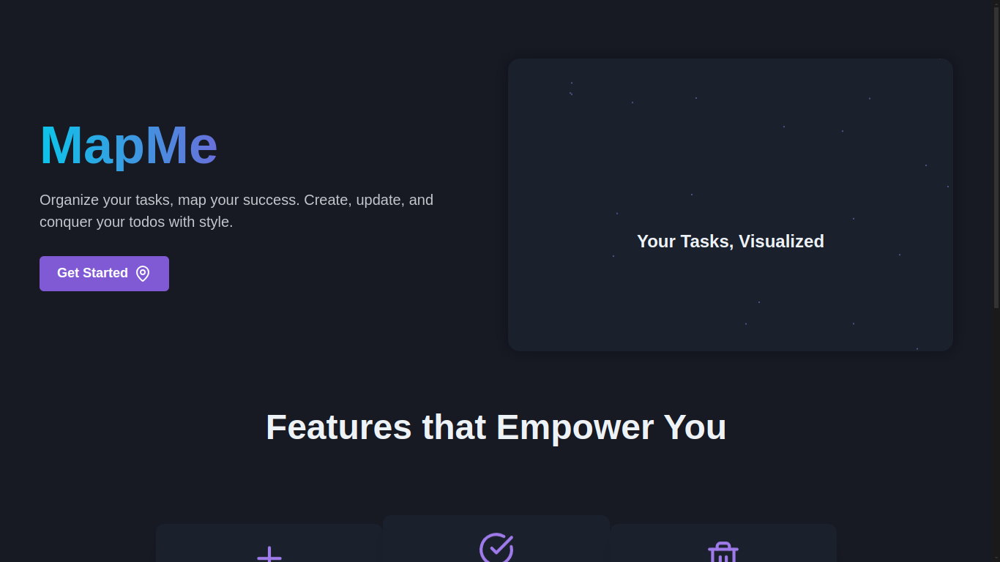
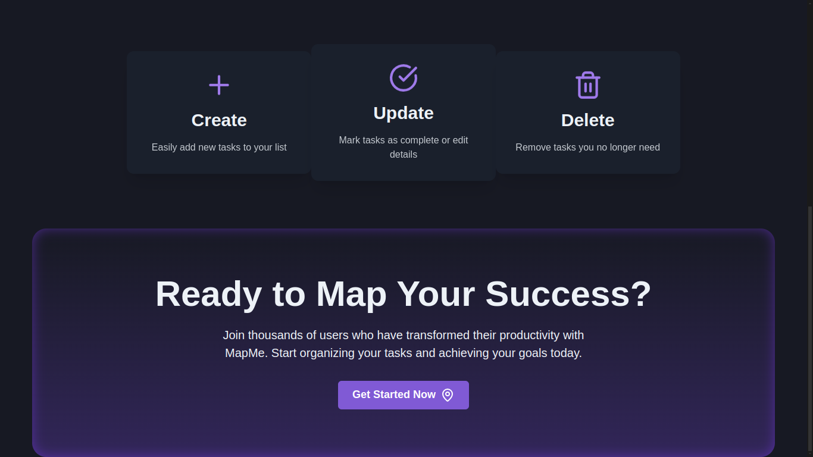
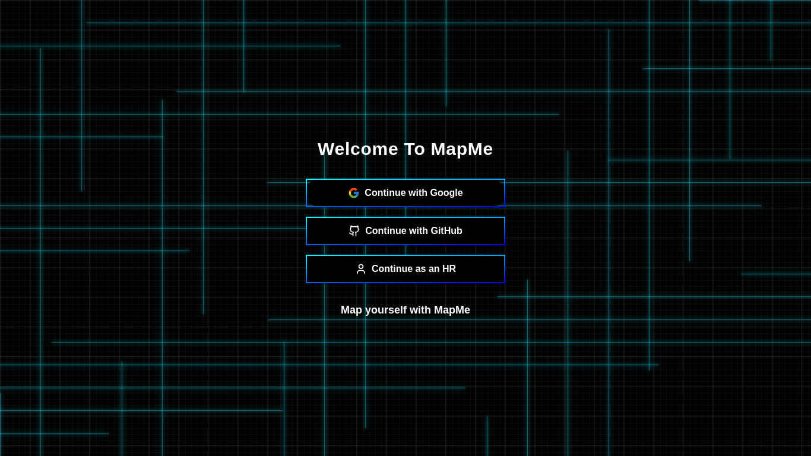

# 🌍 MapMe - Task Management Web Application

**MapMe** is a sleek, intuitive task management web app that allows users to create, organize, and manage their tasks effectively. Built with modern, efficient technologies, MapMe provides a responsive and enjoyable experience for organizing daily to-do items. 

## 🌟 Features

- **Create, update, and delete tasks** with ease
- **Categorize tasks** for better organization
- **Responsive UI** for a seamless experience across devices
- **Real-time updates** with efficient state management

## 🖼️ Visuals

Here are some screenshots of the MapMe application in action:

### Home



### Authentication Screen


## 🚀 Quick Start

1. **Clone the repository**:  
   ```bash
   git clone https://github.com/DevDhanadiya-2007/MapMe.git
   ```
2. **Install dependencies**:  
   ```bash
   pnpm install
   ```
3. **Set up environment variables** for PostgreSQL and Prisma:
   - Add your PostgreSQL connection URL in `.env`
4. **Run the development server**:  
   ```bash
   pnpm dev
   ```
5. **Prisma database setup**:
   ```bash
   pnpm prisma migrate dev --name init
   ```

## 🛠️ Tech Stack

| **Technology**       | **Description**                                                                                             |
|----------------------|-------------------------------------------------------------------------------------------------------------|
| 🌐 **Next.js**       | The React framework for fast, SSR, and scalable applications                                               |
| 💼 **Prisma**        | Type-safe ORM for managing data and connecting to PostgreSQL                                               |
| 🐘 **PostgreSQL**    | Reliable open-source relational database                                                                  |
| 🎨 **Chakra UI**     | A simple, modular component library for beautiful and accessible interfaces                               |
| 🌈 **Tailwind CSS**  | Utility-first CSS framework for rapid UI design                                                           |
| ⚙️ **TypeScript**    | Type-safe language enhancing code quality and maintainability                                            |
| 🌀 **Recoil**        | A state management library for global, shared state with minimal boilerplate                              |

## 📚 Project Structure

```
└── 📁MapMe
    └── 📁prisma
        └── schema.prisma
    └── 📁public
        └── 📁images
            └── auth.png
            └── home1.png
            └── home2.png
    └── 📁src
        └── 📁app
            └── 📁(home)
                └── page.tsx
            └── 📁api
                └── 📁auth
                    └── 📁[...nextauth]
                        └── route.ts
                    └── 📁status
                        └── route.ts
            └── 📁auth
                └── page.tsx
            └── favicon.ico
            └── layout.tsx
        └── 📁components
            └── 📁ui
                └── 📁backgrounds
                    └── Auth-Background.tsx
                └── 📁items
                    └── GlowingButton.tsx
                    └── Loader.tsx
                    └── SkeletonItem.tsx
        └── 📁hooks
            └── useAuth.ts
        └── 📁providers
            └── 📁Root-Provider
                └── RootLayoutProvider.tsx
            └── 📁Wrappers
                └── AuthProvider.tsx
                └── ChakraUiProvider.tsx
                └── NextAuthSessionProvider.tsx
                └── RecoilRootProvider.tsx
        └── 📁store
            └── 📁atoms
                └── index.ts
            └── 📁selectors
                └── index.ts
        └── 📁styles
            └── 📁theme
                └── index.ts
            └── globals.css
        └── 📁types
            └── 📁auth
                └── index.ts
            └── index.ts
            └── next-auth.d.ts
    └── .env
    └── .env.example
    └── .gitignore
    └── LICENSE
    └── next-env.d.ts
    └── next.config.mjs
    └── package.json
    └── pnpm-lock.yaml
    └── postcss.config.mjs
    └── README.md
    └── tailwind.config.ts
    └── tsconfig.json
```

## 🔧 Installation & Usage

Follow the steps in the **Quick Start** section above to run MapMe locally. Once the server is up, you can start creating, editing, and managing your tasks right from the web interface.

---

Happy organizing with **MapMe**! 🎉
